# 应用软件及脚本

## module基本使用

Module中一个比较重要的文件modulefile文件，每个软件都需要有对应的modulefile文件，里面定义了该软件所需要的所有环境变量、软件说明、依赖的其他软件和库文件等，需要使用该软件时，我们用相关命令载入该modulefile文件，即可载入该软件的所有环境变量、依赖软件和库文件等。下面是module常用的一些命令：

1. `module available`
  列出所有可使用的软件。可以用`module av`简写来代替，同时`module av`支持模糊搜索，例如`module av m`会列出所有以m开头的软件

2. `module load modulefile`
  加载某个软件

3. `module unload modulefile`
  卸载某个软件

4. `module purge`
  清除所有已经加载的软件

5. `module list`
  列出目前已经加载的软件

6. `module show modulefile`
  列出某个软件modulefile里的内容

7. `module switch|swap [modulefile_old][modulefile_new]`
  在不同的软件版本之间切换

## singularity

容器作为轻量级的虚拟机，可在主机之外提供多种系统环境选择，如某些软件可能只在某个linux发行版本上运行；另外，在容器中一次打包好软件及相关依赖环境之后，即可将复杂的软件环境在各种平台上无缝运行，无需重复多次配置，大大减轻相关工作人员的工作量；因为可以利用容器技术在一台物理机器上部署大量不同的系统（一台物理机支持的容器远多于传统虚拟机），提高了资源利用率，因此在近几年变得非常流行。目前主流的容器为docker，其最初被用于软件产品需要快速迭代的互联网行业，极大地简化了系统部署、提高了硬件资源的利用率，近来也在各种特定领域的应用系统中被使用。

singularity 调用

singularity有许多命令，常用的命令有，pull、run、exec、shell、build

1. `pull`: 从给定的URL下载容器镜像，常用的有URL有Docker Hub(docker://user/image:tag) 和 Singularity Hub(shub://user/image:tag)，如

    ```bash
    singularity pull tensorflow.sif docker://tensorflow/tensorflow:latest
    ```

2. `run`: 执行预定义的命令

3. `exec`: 在容器中执行某个命令
  
    ```bash
    singularity exec docker://tensorflow/tensorflow:latest python example.py
    ```
  
    或
  
    ```bash
    singularity exec tensorflow.sif python example.py
    ```

4. `shell`: 进入容器中的shell

    ```bash
    singularity shell docker://tensorflow/tensorflow:latest
    ```

    或

    ```bash
    singularity shell tensorflow.sif
    ```

    然后可在容器的shell中运行自己的程序

5. `build`: 创建容器镜像

## 脚本

脚本文件放于/public/slurmscript_demo中，手册中列出部分常见的脚本

### abaqus

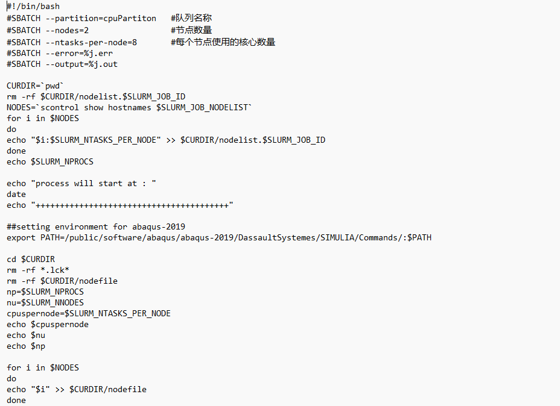
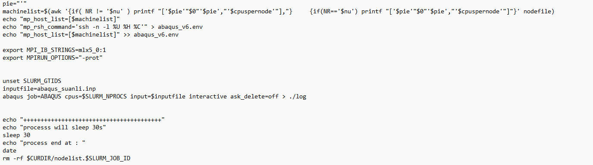

### amber

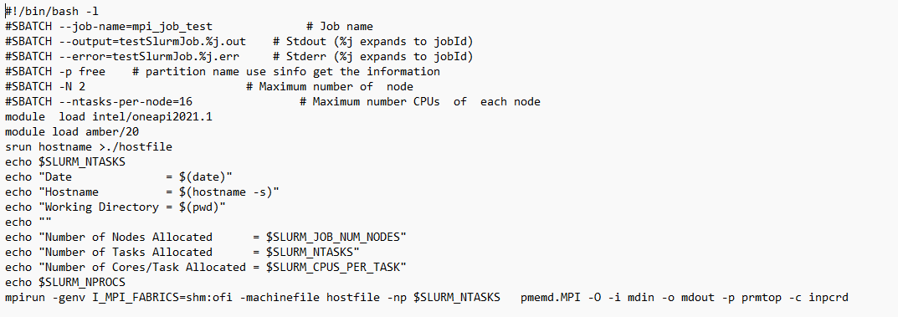

### lammps

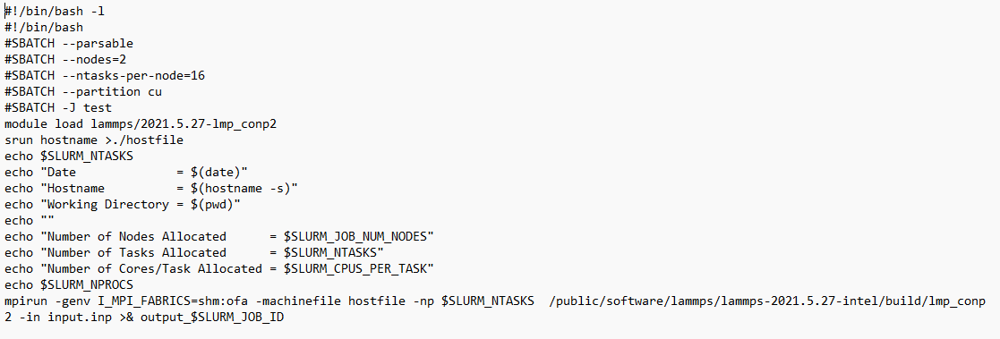

### lammps-intel

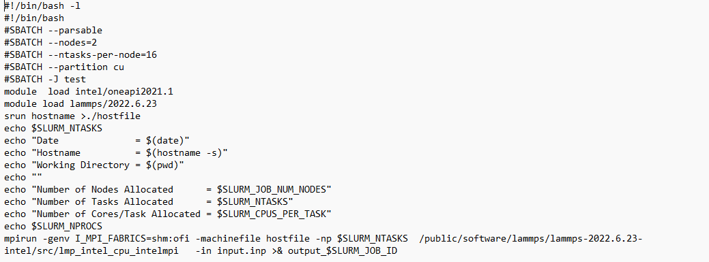

### orca

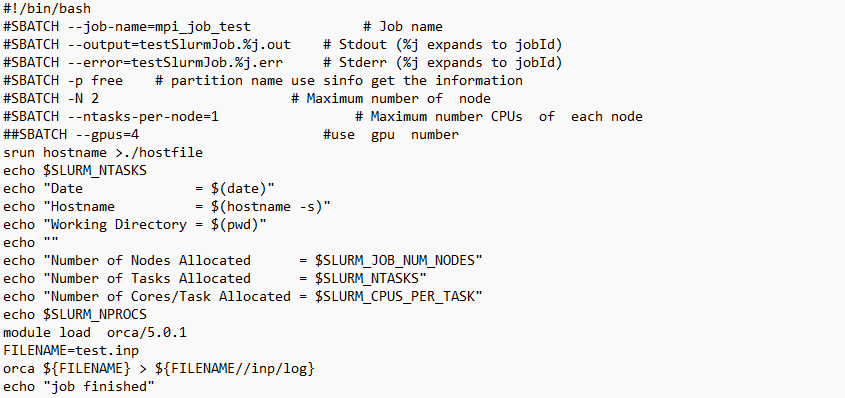

<!--
### jdftx

### pytorch
-->
### gromacs-gpu

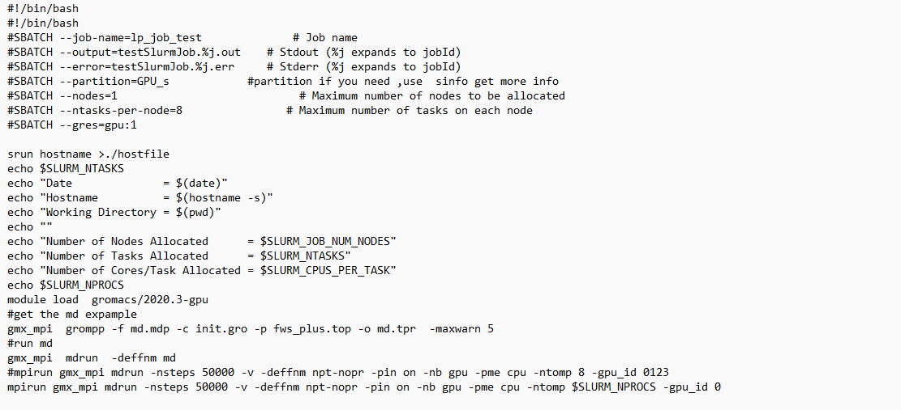

### gromacs-cpu

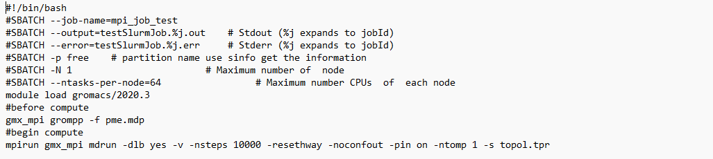

### matlab

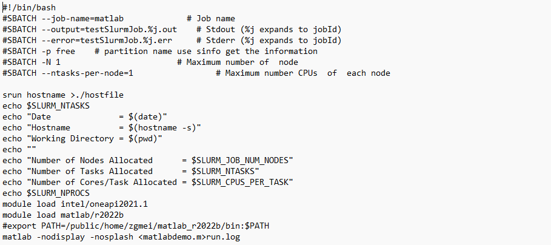

### comsol

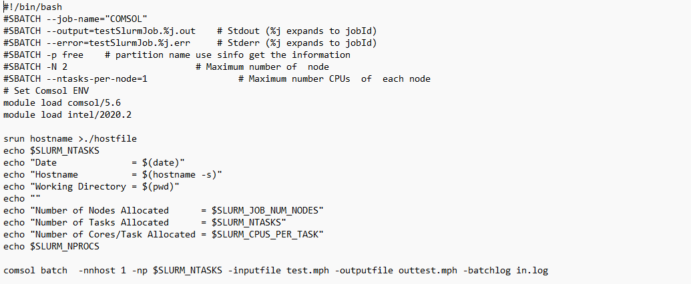

### cp2k-2022

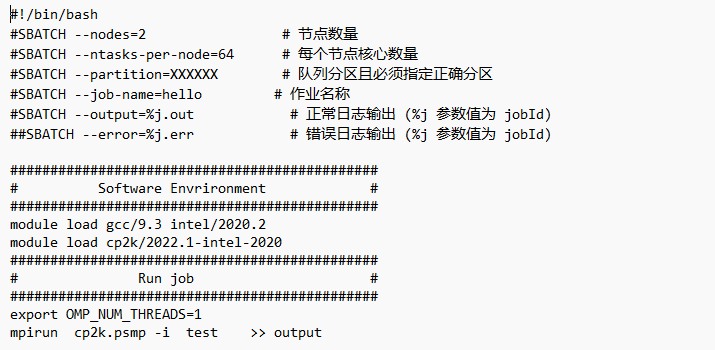

### vasp

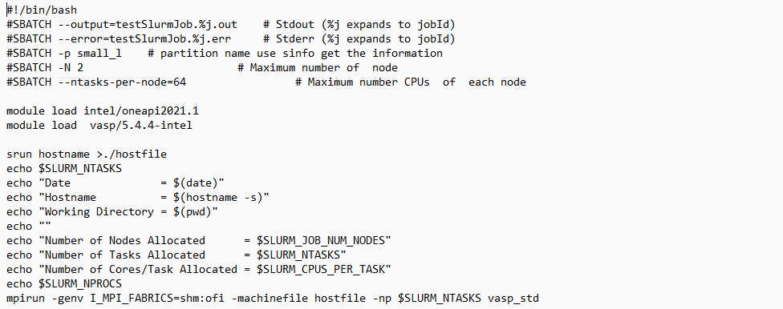

### g16

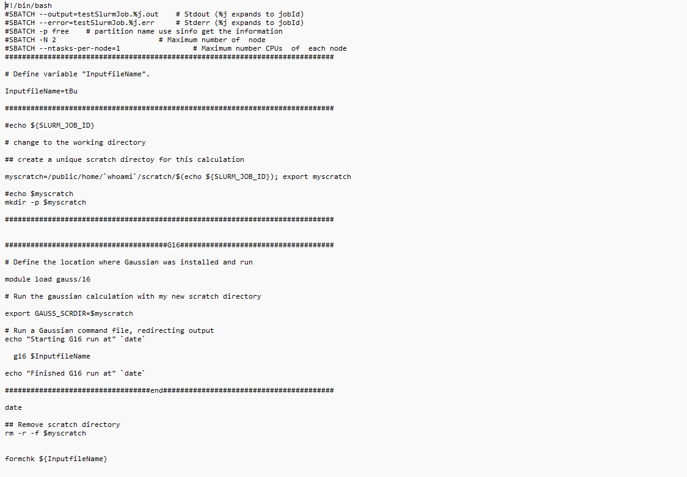
