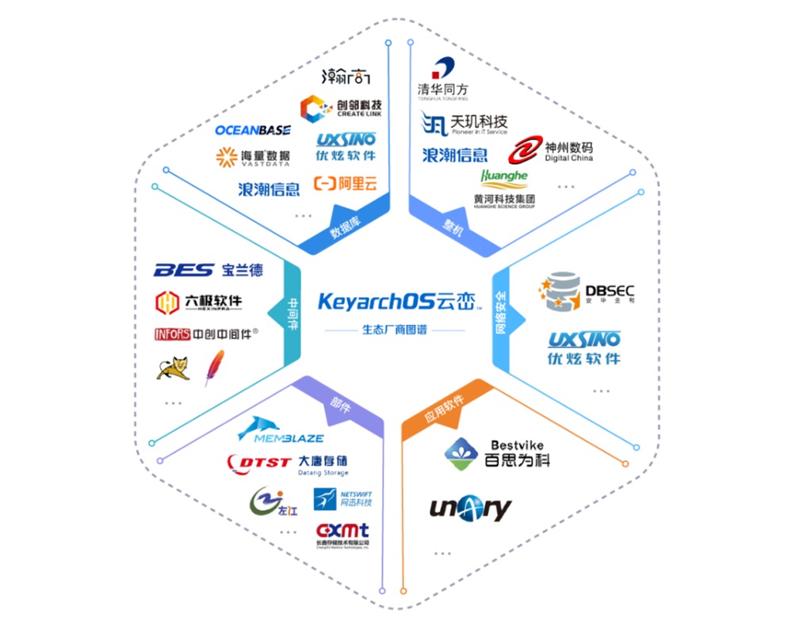

---
date:
  created: 2024-11-30
authors:
  - link89
---

# 嘉庚智算中心软件全面升级

> 原文链接：https://ai.meta.com/blog/llama-3-2-connect-2024-vision-edge-mobile-devices/

> 原文链接：https://www.nature.com/articles/d41586-024-03708-4

当你看到上面的新闻，迫不及待地登录智算集群打算尝鲜时，一定不希望遇到因为系统过于老旧导致软件无法安装成功的问题。或者你已经习惯于在 Jupyter Notebook 上编写代码与绘制图表，但是面对漆黑的命令行终端时常常会感到不知所措。又或者，作为团队负责人的你正在为如何有效管理研究组成员的机时使用而烦恼时。别担心，嘉庚智算中心升级将为您提供全面的解决方案。

嘉庚智算中心运营团队（AI4EC Lab）为了应对操作系统停止支持带来的潜在安全和功能性问题，也为了让用户在嘉庚智算集群有更好的使用体验，与浪潮信息团队合作，为嘉庚智算集群量身订制了一套软件升级计划。升级作业于10月国庆期间启动并在10月中旬顺利完成，如今已平稳运营一个多月。接下来本文将带大家一起回顾此次集群升级带来的一些新变化，帮助大家更好地了解和使用智算中心的算力资源。

## 更安全、更高效的国产操作系统

CentOS 7 自2014年发布至今已有10年，2020年停止更新，并于今年彻底停止维护，这意味着今后CentOS 7系统将无法继续安装官方软件包。虽然 CentOS 以可靠性著称在高性能计算和云计算等领域被大量使用，但多年停止更新导致一些新发布的软件由于版本兼容性问题难以直接编译或安装。例如，由于glibc版本低导致新版本的PyTorch无法正常编译，虽然可以借助容器或者热补丁等更为复杂的解决方案进行规避，但这无疑增加了用户的使用成本。长期停止更新也导致一些能为系统带来性能提升的新特性无法使用，同时也留下大量安全隐患。

为了一劳永逸地解决以上问题，嘉庚智算运营团队与浪潮信息团队在经过大量的方案评估和讨论后，最终选择使用由浪潮信息研发的国产化操作系统 KOS 5.8 作为集群的新系统。如今在嘉庚智算集群上用户可以用更简单便利的方式编译或安装大部分最新版本的计算软件，无需再应对各种恼人的版本过低问题。对于有兴趣追求性能或者探索新特性的用户，也有诸如XPMEM等新功能可供使用。

## 更友好的交互式应用支持

随着Colab等在线计算平台的流行，越来越多的人开始习惯于在Notebook上完成计算工作。相比与传统超算平台只能在终端界面运行命令或脚本，Notebook 的优势在于提供更丰富的交互功能，并能够忠实地记录完整计算过程，当你在Notebook上完成所有工作时，你同时也就得到一份图文并茂的报告，可以方便地用它向他人介绍或分享你的成果。

为了让用户能在嘉庚智算集群上有同样便捷的体验，嘉庚智算运营团队推出了 **嘉庚智算中心服务门户**。该门户应用北京大学推出的开源算力管理方案（SCOW）进行集群管理工作，旨在解决当前算力中心面临的管理运营难、用户使用难、算力融合难等问题。

现在您 **可以直接通过服务门户使用Jupyter Notebook 完成计算工作**。

## 更精细的预算管理功能

智算集群的核心功能是让用户可以用简单的方式调度大量资源进行计算。然而，这样的易用性也意味着，课题组的新生可能会因为将一个尚未验证完毕的程序投入大规模计算，将课题组所属账户中的机时费用消耗殆尽，进而影响了整个课题组的科研进度。

嘉庚智算中心服务门户 **为每个账号管理员提供了限制每个用户可用经费额度的功能**，方便您根据研究的进展为每一位共享经费的成员设置一个合理的预算。例如，在研究起步阶段，您可以为相应成员设定一个费用上限用于进行实验性的计算，在这笔费用用完后该用户将无法提交新作业，如该用户需要继续向集群提交作业，则必须向对应账号的管理员申请提升上限。如此一来，账号管理员即可以 **通过预算管理对研究进度进行跟踪，避免在不知情的情况下浪费大量机时。**

## 后记

此次智算集群的升级工作除了上述几个比较重大的更新外，还包括全新的在线文档：<https://ai4ec.ikkem.com/ikkem-hpc/doc/>，以及登录节点资源自动管理等功能。后续嘉庚智算运营团队还将陆续发布一系列文章，向大家更详细地介绍如何使用智算中心提供的各种能力，尽请期待。

## 关于我们

### 关于作者

**徐伟鸿** 嘉庚创新实验室高级软件工程师，多年互联网从业经验，先后于美团、铃盛等企业担任系统工程师、技术团队经理等职务。目前负责嘉庚创新实验室、嘉庚智算中心和AI4EC实验室的软件开发和信息化建设工作。

### 关于嘉庚智算中心

嘉庚创新实验室智能计算中心（简称“嘉庚智算中心”）于 2022 年建成投用，通过先进液冷技术实现绿色节能，并配备了先进的计算硬件。集群包含390 个 CPU 计算节点、**6 个 GPU 计算节点（共计48张A100 80G NVLink 全连接计算卡）** 和 2 个胖节点，能支持模型训练、模拟仿真、大规模科学计算。

### AI4EC Lab
人工智能应用电化学联合实验室（AI4EC Lab）由嘉庚创新实验室与北京科学智能研究院于2022年合作创立。围绕“科学智能加速电化学科学和工程创新”的使命，联合实验室将致力于将人工智能与电化学理论相结合发展智能算法和机器学习模型，加速电化学基础创新，并驱动电化学应用的拓展。

**AI4EC Lab正着力寻求三大方面的突破**  

-   机器学习算法加速从头算分子动力学，发展电化学体系中复杂材料结构模拟和物化性质计算的解决方案，助力材料筛选设计；
-   针对复杂电化学体系开发智能谱学计算和分析平台，建立“谱构”关系模型，助力电化学器件原位、工况表征检测；
-   发展电化学器件跨尺度仿真策略结合微观材料计算和表征实验数据以及人工智能算法，推动器件智能优化。
    

### 联系我们

官方网站: <https://ai4ec.ikkem.com>

电子邮箱: <mailto:ai4ec@xmu.edu.cn>
