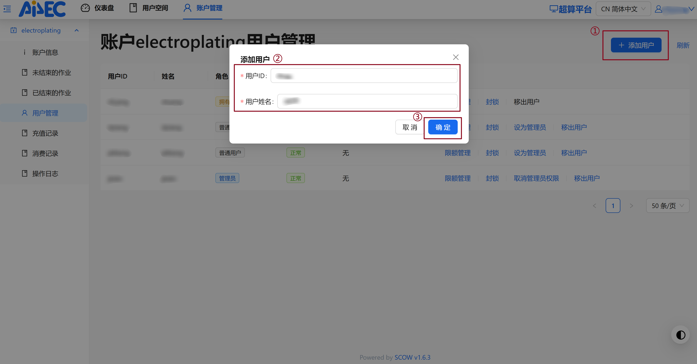
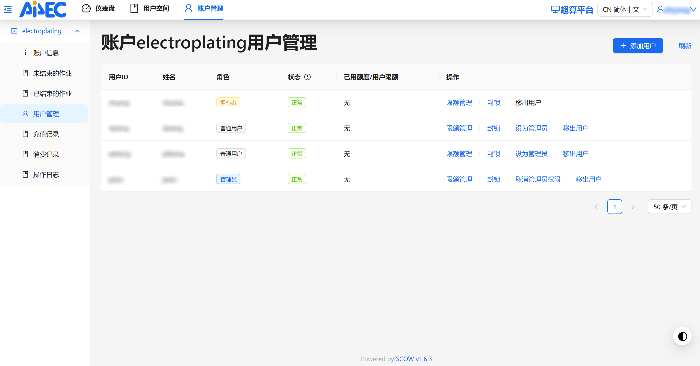
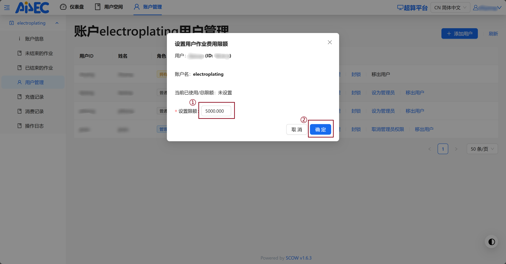
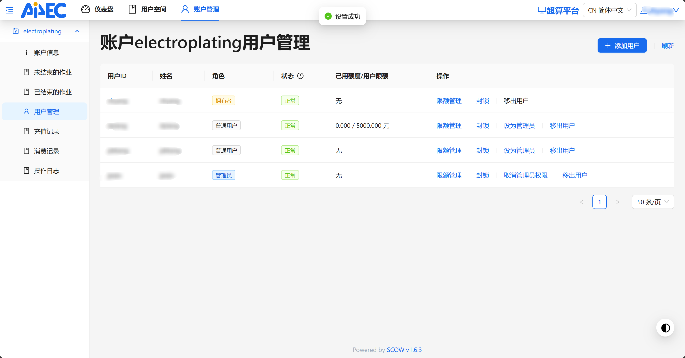
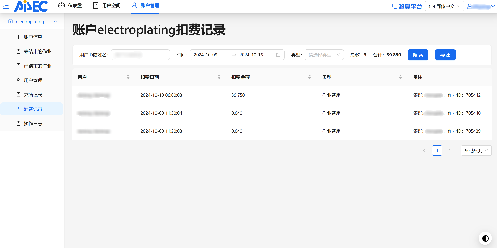
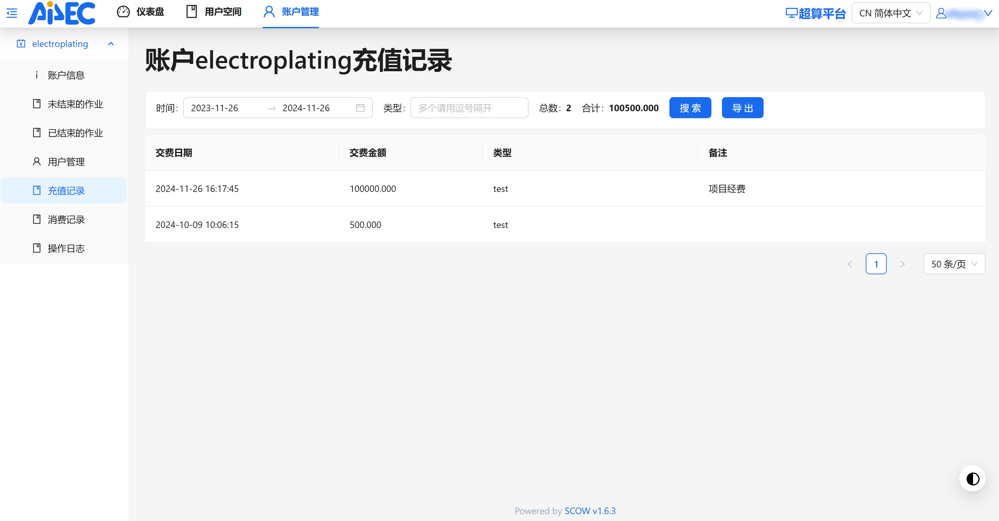

---
authors:
  - cloudac7
date: 2024-12-05
---

# 嘉庚智算账户管理最佳实践——支持课题组计算资源管理细分到人

嘉庚创新实验室智能计算中心（以下称“嘉庚智算中心”）最新升级——上线基于SCOW的 **嘉庚智算中心服务门户**。

该平台支持账户管理员按照项目管理的需要，实现经费使用情况精细到每一位用户进行精确把控。账户管理员可以对每个用户能够使用的经费进行限额管理，以规避潜在的资源浪费情况，提升经费的使用效率。

以下我们以一个具体场景为例来说明账户管理员如何利用嘉庚智算中心服务门户提供的账户管理功能对用户的机时和经费使用情况进行管理和把控。

<!-- more -->

# 应用场景

假设A老师课题组（账户名electroplating，下设账户管理员B同学等人）今年有新入学的C同学和D同学，按照课题规划交给B同学指导。两位同学可在嘉庚智算中心开立个人用户，并申请使用A老师课题组账户内的经费进行计算。

- C同学之前在其他项目参与过实习，在智算平台上已经开户，但经费隶属于其他账户且原账户已经欠费；
- D同学之前未开通过智算用户，则需要先填写申请开户，完成开户流程，获得用户名和密码。

此时两位同学可直接联系A老师课题组的账户管理员（如B同学），账户管理员通过管理平台添加C同学的用户为electroplating账户组成员。后续账户管理员可以通过经费限额等方式对两位同学的课题进行全流程管理。

我们将以以下两个案例来详细说明上述流程。

# 案例目标

- 希望将C同学和D同学加入到electroplating组，授予其项目经费使用权限；
- 由于D同学没有相关计算经验，故在入门阶段希望为D同学设置5000元的经费限额，以便对其项目进行把控。

以下将对案例两种情况的解决方案分别进行详细说明。

# 解决方案

## 管理员将用户添加到账户组（以C同学为例）

作为账户管理员的B同学在收到C同学的联系后，便可以登录进入SCOW后台，点击“超算平台”，选择“账户管理”界面，如图输入C同学的用户ID和姓名（注意应在用户列表中查询确认正确的 **用户ID-姓名** 组合）。



点击确定，稍作等待后即添加成功：



当然，作为账户所有者的A老师还可以在当前页面增设其他管理员，协同进行管理。

经过上面的操作以后，C同学便可以通过原本的用户，在提交脚本中指定新的账户对作业进行提交：

```bash
#SBATCH -A electroplating
```

用同样的操作流程还可以将D同学添加到electroplating账户组。

## 组内项目管理最佳实践（以D同学为例）

在实际的科研过程中，由于用户的水平参差不齐、软件环境千差万别，在智算平台上时常会出现这样的场景：

- 用户X有着优秀的代码能力，可以手撸代码实现自己的需求，但由于上游编译环境本身的bug，其软件未正确编译，可能导致输出存在数值bug。经历了长时间的计算仍未能得到预期结果的用户A最终发现问题，且切换集群提供的其他编译环境可以正确编译，但此时经费已经烧完，面对着不知何时已经花完的20000元机时，束手无策。
- 用户Y通过脚本在同一作业中实现大量任务的批量提交，但由于经验不足，其未对工作流中的子任务设置有效的续算检验机制，工作流因意外情况中止，便不得不从头开始。于是已经进行过的作业任务被重复计算，消耗了大量机时。
- 用户Z是计算化学新手，入门计算时尚未充分理解背后原理，用错误的计算设置在未经师兄/师姐把关的情况下，直接投入大量作业任务进行批量计算，师兄/师姐处理数据时发现异常，只得含泪要求用户C重算一遍，但经费历经浩劫已耗竭。

为了针对性地解决这些问题，账户管理者可以利用升级后的SCOW平台，对每个用户的使用情况进行精准把控和管理。以下我们将以D同学作为例子来展示一个项目全过程管理的案例。

假设D同学的目标是对多种离子在水溶液中的扩散系数进行批量计算，为实现这一目的，需要对其任务进行拆解。

### 测试阶段

这一阶段对计算的设置进行测试，通过单个体系、短时间计算任务的快速提交，确保输入参数没有异常，计算的结果符合预期，软硬件兼容性正常，可以正确使用计算的资源。

对应到上面的案例，即需要D同学在师兄B同学的指导下用较少的经费先构建一种离子的模型和计算输入，并设定一个较短的步数，同时设置好重启计算的checkpoint以确保后续生产可以继续在测试通过的输入上续算，最大程度减少机时的消耗。

这一阶段由于用户往往对自己所需要消耗的经费缺乏预期，则建议账户管理员（B同学）根据自己的经验进行估计，确定单个体系测试需要的机时，并适当预留冗余，换算成经费。例如经过估计，预计D同学这一阶段需要 5000 元的测试机时，则账户管理员可以对该用户在SCOW管理平台设置费用限额，点击确定即可。



可以看到此时即为用户添加了限额配置，从而可以精准管理其当前所能够使用的资源上限。

当使用资源达到上限时，则系统会限制该用户继续提交新的作业任务。



除此而外，对于违规的用户，在当前界面还可以使用封锁等功能，临时限制其提交新的作业。同时也可以对已经不再隶属于当前研究小组的用户可以执行移出操作。

### 执行阶段

经过测试，D同学完成了既定的目标，即对单一体系的计算有了概念和思路，并且对于自己跑一段时间相应任务所需的经费有了认识。于是师兄/师姐认为他可以继续进行其他体系的计算，经过两个人的讨论和估计，整个项目约消耗100000元的机时费用。

账户管理员对于其上报的预算进行审核后确认前期准备充分、机时费用估计合理，于是在SCOW平台上对D同学的限额进行调整，将可用额度调整为100000元。

### 管理用户使用情况

在项目实际进行过程中，账户管理员希望对机时的消费情况进行全过程管理。SCOW平台为其提供了以下功能。

#### 消费记录

首先，为了对账户组的经费使用进行合理追踪，账户管理员B同学可以查询一段时间内的消费记录。并可根据用户ID进行精确检索，以显示每个人各自的使用情况。



例如可以对D同学的消费情况进行把握，如图可见D同学在一段时间内运行了3个任务，分别花费39.75、0.04、0.04元。0.04元的作业是其进行的测试，由于输入存在问题未能正确运行，而39.75元的作业则是正确提交后的作业。

页面内还提供了导出功能，供账户管理员导出原始信息进行进一步核对和分析。

#### 充值记录

同时，为了确保经费的到账情况，账户管理员可以对当前账户的充值情况进行管理，便于查账、对账：



### 结项

经过一段时间的努力，D同学顺利完成了课题的既定目标，得到了良好的数据，并着手进行后续分析。

而经过和同门及师兄师姐讨论，他也确定了新的课题方向，并制定了合理的proposal。账户管理者经过审核确认其proposal内容合理完善，因此可以在SCOW平台上取消原限额，并重新设立新的限额。

同样地，新项目也往往需要拆解成多个步骤进行管理，则账户管理员可以沿袭上面的实践，来对组员的经费使用进行合理调控。

多年以后，成为资深组员的D同学被授予了账户管理员权限，回想自己一路成长的经历，对师弟/师妹的指导已经形成了言传身教的良好实践。

# 总结

嘉庚智算本次升级引入的嘉庚智算中心服务门户，对项目全流程细分到人的精细管理实现了良好支持，方便账户管理员结合实际情况形成适合自己组的良好实践。

本文旨在抛砖引玉，介绍管理平台提供的强大能力，帮助各位管理者学习如何在机时层面对组内同学进行指导和全流程把握，同时执行计算的同学们也能够严肃对待自己在集群上提交的每个作业，确保每一笔科研经费花到实处。

同时围绕此次智算集群的升级工作，欢迎参考我们全新的在线文档：[https://ai4ec.ikkem.com/ikkem-hpc/doc/](https://ai4ec.ikkem.com/ikkem-hpc/doc/)。嘉庚智算运营团队将陆续发布一系列文章，向大家更详细地介绍如何使用智算中心提供的各种能力，敬请期待。

## 关于我们

### 关于作者

刘云霈 嘉庚创新实验室工程师，博士阶段主要从事计算化学、机器学习方面研究。目前负责嘉庚智算中心软硬件一体化运营工作。

### 关于嘉庚智算中心

嘉庚创新实验室智能计算中心（简称“嘉庚智算中心”）于 2022 年建成投用，不但配置先进液冷技术，实现绿色节能，更是配备了先进的计算硬件（390 个 CPU 计算节点、6 个 GPU 计算节点和 2 个胖节点），能支持模型训练、模拟仿真、大规模科学计算。