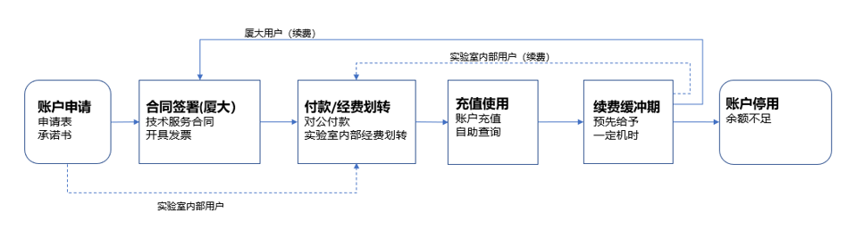
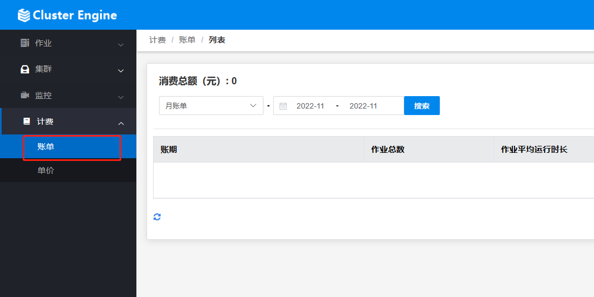
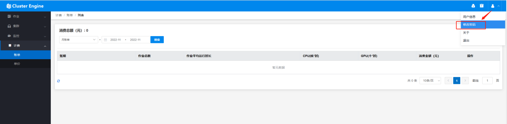

# 使用流程

## 账号申请：

1. **邮件申请**
   - 需要使用嘉庚智算中心计算资源的老师同学们通过自己的厦大邮箱发邮件给：ynwang@xmu.edu.cn，智算中心将通过邮件回复申请流程和相关申请材料

2. **完成申请表填写**
   - 厦大用户需要以课题组/项目组为单位申请，请申请使用机时前明确内部用户数量，**同一课题组/项目组用户集中在一张申请单上申请。需要填写以下两个材料：**
     1. **填写《账户申请表》，请课题组/项目组负责人签字。**
        [点击下载](../_files/1.docx)
     2. **填写《用户承诺书》，请课题组/项目组内需使用机时的全部用户签字。**
        [点击下载](../_files/2.docx)
   - **将以上两份文档签字扫描件请传回智算中心邮箱（需抄送课题组负责人），并在邮件中包含以下文字内容：**
     - **“本课题组/项目组需要在嘉庚创新室实验智算中心进行计算，烦请帮忙开通课题组/项目组PI账号，谢谢！开通PI账号姓名：XXX（课题组/项目组负责人姓名）”**
   - 以上两份文档纸质版请提交至嘉庚智算中心（能源材料大楼2号楼 2276），邮寄地址如下：
     - 地址：厦门大学翔安校区能源材料大楼1号楼
     - 收件人：王燕妮
     - 联系电话：18030016936

## 充值缴费

- 厦大用户与实验室用户充值流程如下，具体合同签署、收费标准事宜可发邮件给ynwang@xmu.edu.cn联系商议。

## 账单查询

1. **邮件获取初始密码**
   - 初始密码请发送邮件到 ikkemhpc@xmu.edu.cn，说明需要初始密码自助查询账单。

2. **登录系统自助查询**
   - 访问https://10.26.14.57，用户名与所申请的系统用户名一致。登录后按照如下方式即可查询使用账单：

3. **修改密码**
   - 第一次登录后，务必修改密码，方式如下：

