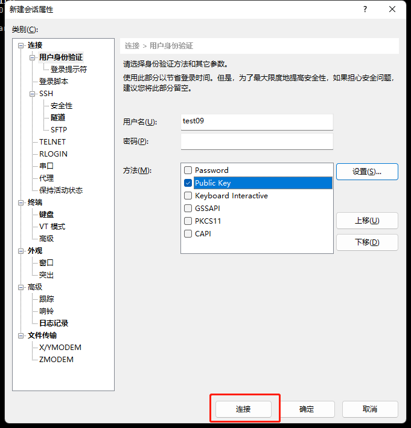

# 用户登录与文件传输

嘉庚智算中心目前仅支持通过密钥方式登录，不支持通过密码方式登录。

**1. 密钥分发**

用户申请完账号后，管理员会将用户的密钥发送到申请账号时预留的厦大邮箱，按照邮箱指引解压缩附件即可获取到密钥。用户务必妥善保管好该密钥，不得将密钥给与他人使用。

**2. 登陆系统**

**Windows用户**

**通过xshell(version 7)工具登录**




**通过CMD(命令提示符)直接登录**

将获取到的密钥文件（id_rsa）拷贝到C:\\Users\\user1\\.ssh目录下


说明：1.user1为当前windows实际登录账号，此处仅供参考。2.此处假设用户.ssh目录下没有id_rsa同名密钥文件，如有冲突可以联系我中心管理员协助处理。

通过CMD(命令提示符)登录到登录节点，命令为： `ssh account@10.26.14.56`，此处account请替换为3.1章节实际申请的用户账号。如下：


**通过SecureCRT工具登录**

以secureCRT version 9.2.3为例：


**MAC电脑用户**

1. 将4.1章节获取到的密钥文件（id_rsa）拷贝到~/.ssh目录下
2. 在本地 ~/.ssh/config 配置文件中添加ssh服务器信息，格式：

```
Host ikkemhpc #自定义别名
HostName 10.26.14.56 #HPC集群登录节点IP
Port 22 #HPC集群登录节点IP
User user #根据申请的用户名，按照实际情况修改
IdentityFile ~/.ssh/id_rsa #根据获取到的私钥文件名称
```

3. 在MAC电脑命令行终端输入命令: `ssh ikkemhpc`，即可登录到HPC集群登录节点。

[CentOS](http://www.centos.org/) (Community ENTerprise Operating System) 是Linux主流发行版之一，它来自于Red Hat Enterprise Linux依照开放源代码规定释出的源代码所编译而成；`man` 命令或命令加 `-h` 或 `-–help` 等选项来查看该命令的详细用法，详细信息可参考CentOS、Red Hat Enterprise Linux手册或通用Linux手册。

**3. 文件传输**

**SCP命令行传输文件**

Windows/Linux/Unix/Mac用户均可通过在命令行终端中使用scp命令传输。如果传输的对象为少量大文件，且目标环境上没有数据的历史版本，所有需要传输的文件都是首次传输（避免覆盖原来的文件），可以使用scp直接拷贝文件。举例如下：

假设用户user01在智算中心平台上个人目录为/public/home/user01

示例1：将本地目录D:\\data的全部数据上传至智算中心集群用户user01的家目录下（以下命令在用户本地电脑运行）

```
scp -r D:\\data\\ user01@10.26.14.56:/public/home/user01/
```


示例2：将集群中用户user01家目录中的~/math.dat文件下载到本地电脑的D:\\data目录下（以下命令在用户本地电脑运行）

```
scp user01@10.26.14.56:/public/home/user01/math.dat D:\\data\\
```


**XFTP传输文件**

如果已经装了xftp软件，也可以使用xftp软件进行文件传输：


