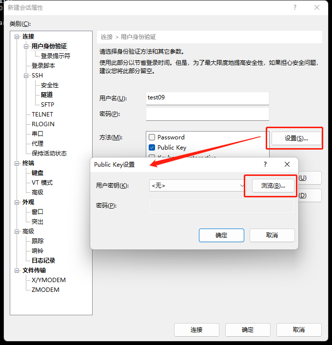
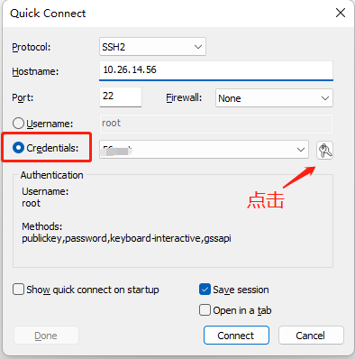
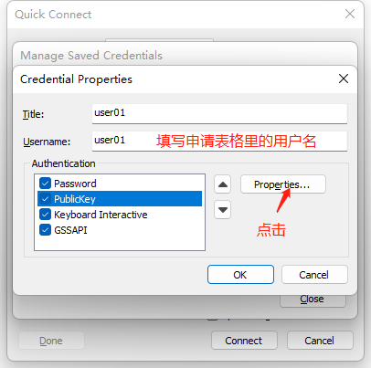
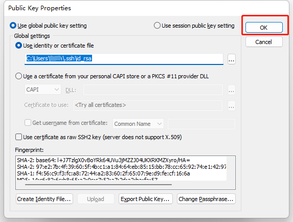
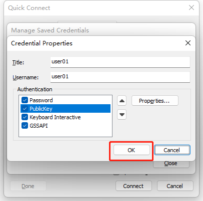
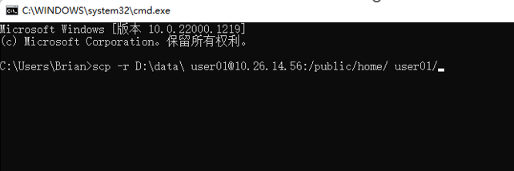
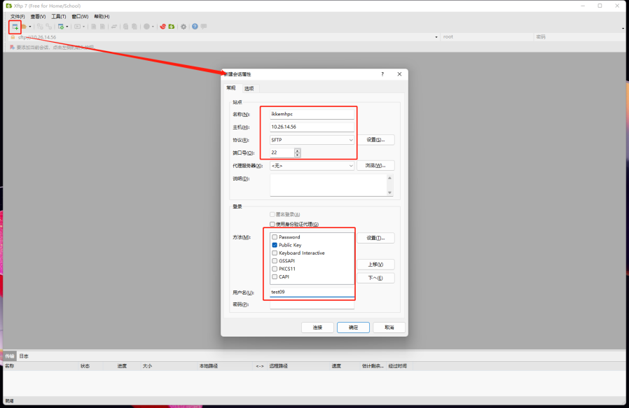
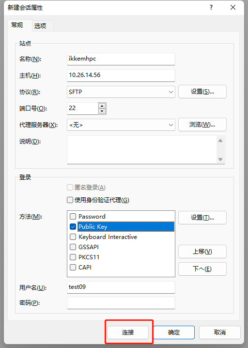

# 用户登录与文件传输

嘉庚智算中心目前仅支持通过密钥方式登录，不支持通过密码方式登录。

## 密钥分发

用户申请账号后，管理员会将用户的密钥发送到申请账号时预留的邮箱中，按照邮箱指引解压缩附件即可获取密钥。

**用户务必妥善保管好该密钥，请勿泄露。**

## 登陆系统

!!! info 
    当前集群登录节点 IP 为 10.26.14.64。
    
    仅厦大校内网可以访问，校外用户请通过 SSLVPN 或零信任终端访问。

!!! failure
    旧登录节点IP 10.26.14.56 **已停止任务提交**，如遇到作业长久排队且计算节点均显示为 Drain 状态请检查登录节点是否正确。

### Windows用户

#### 通过 MobaXterm 登录

MobaXterm 是 Windows 下一款终端软件，支持SSH、WSL等，并且包含一个集成的 X 桌面服务，允许您远程运行图形应用程序（如 gnuplot、VMD 等）。

您可以从以下链接下载 MobaXterm 家庭版（安装版）：

[安装 MobaXterm](http://mobaxterm.mobatek.net/download-home-edition.html)

请按下图所示步骤操作，在第④步时请导入邮件中收到的密钥，然后点击 OK 即可登录。


#### 通过 XShell(version 7) 工具登录





#### 通过CMD(命令提示符)直接登录

> 本方法也适用于使用 Powershell 的情况。我们推荐使用 Windows Terminal 作为终端，Windows 11 用户无须额外下载，Windows 10 用户可以在 Microsoft Store 中下载。

将获取到的密钥文件（id_rsa）拷贝到C:\\Users\\user1\\.ssh目录下


!!! info
    说明：
    1. `user1` 为当前windows实际登录账号，此处仅供参考。
    2. 此处假设用户 `.ssh` 目录下没有 `id_rsa` 同名密钥文件，如有冲突可以联系管理员协助处理。

通过CMD(命令提示符)登录到登录节点，命令为： `ssh account@10.26.14.64`，此处account请替换为实际申请的用户账号。如下：


#### 通过SecureCRT工具登录

以secureCRT version 9.2.3为例：









### MAC电脑用户

1. 将获取到的密钥文件（`id_rsa`）拷贝到 `~/.ssh` 目录下
2. 在本地 `~/.ssh/config` 配置文件中添加 SSH 服务器信息，格式：

    ```bash
    # 自定义别名
    Host ikkemhpc
        # HPC集群登录节点IP
        HostName 10.26.14.64 
        # HPC集群登录节点IP
        Port 22 
        # 根据申请的用户名，按照实际情况修改
        User user 
        # 根据获取到的私钥文件名称
        IdentityFile ~/.ssh/id_rsa 
    ```

3. 在 Mac 电脑命令行终端输入命令: `ssh ikkemhpc`，即可登录到HPC集群登录节点。

[KeyarchOS](https://www.ieisystem.com/keyarchos/) 来自于Red Hat Enterprise Linux依照开放源代码规定释出的源代码所编译而成；`man` 命令或命令加 `-h` 或 `-–help` 等选项来查看该命令的详细用法，详细信息可参考CentOS、Red Hat Enterprise Linux手册或通用Linux手册。

## 文件传输

### SCP 命令行传输文件

Windows/Linux/Unix/Mac 用户均可通过在命令行终端中使用 `scp` 命令传输。如果传输的对象为少量大文件，且目标环境上没有数据的历史版本，所有需要传输的文件都是首次传输（避免覆盖原来的文件），可以使用 `scp` 直接拷贝文件。举例如下：

假设用户 `user01` 在智算中心平台上个人目录为 `/public/home/user01`

示例1：将本地目录 `D:\data` 的全部数据上传至智算中心集群用户 `user01` 的家目录下（以下命令在用户本地电脑运行）

```bash
scp -r D:\\data\\ user01@10.26.14.64:/public/home/user01/
```


示例2：将集群中用户user01家目录中的~/math.dat文件下载到本地电脑的D:\\data目录下（以下命令在用户本地电脑运行）

```bash
scp user01@10.26.14.64:/public/home/user01/math.dat D:\\data\\
```



### MobaXterm 传输文件

MobaXterm 自身即支持传输文件。登录后在左侧的 Quick connect栏即可右键选择上传文件。


### XFTP 传输文件

如果已经装了xftp软件，也可以使用xftp软件进行文件传输：








### SCOW 平台传输文件

SCOW 平台本身也支持向集群传输文件，有两种方式。

#### 通过文件管理模块

在 SCOW 平台上点击导航栏上的 "文件管理" 即可管理集群上的文件

#### 通过SCOW Shell

在 SCOW 平台上点击导航栏上的 "Shell" 可以启动一个网页终端，支持以下快捷命令的使用：

- 跳转到文件系统：`sopen`，输入该命令后会跳转到文件系统，您可以进行文件的上传和下载
- 文件上传：`sup`，输入该命令后您可以将本地文件上传到当前路径下
- 文件下载：`sdown [文件名]`，输入 `sdown [文件名]`，您当前路径下的该文件会被下载到本地
    使用示例：`sdown hello.txt`
- 文件编辑：`sedit [文件名]`，输入 `sedit [文件名]` 命令后跳转到文件编辑页面， 您可以编辑指定的文件
    使用示例：`sedit hello.txt`

目前这一方式不支持输入相对路径，如果需要下载或编辑其他目录下的文件请使用 `sopen` 命令跳转到文件系统。
