# 嘉庚智算中心服务门户

## 平台概述

在本次升级中，我们引入了基于 [SCOW](https://www.pkuscow.com/) 搭建的 **嘉庚智算中心服务门户**。

通过引入新的服务门户，用户可以通过交互式页面实现作业的便捷提交，并可通过网站提供的 Shell 实现对集群命令行的方便访问，以及在计算节点上创建交互式应用（如 JupyterLab 等）来让自己需要的应用便捷地使用高性能硬件资源。同时，用户还可以通过管理后台对自己的作业运行情况以及扣费情况进行监控，并查看自己可以使用的账户及其对应的余额。这些功能和特性的引入将极大地方便用户使用智算中心的资源完成自己的任务。

另一方面，对于每个账户的管理员，基于服务门户提供的能力，可以对具有本账户使用权限的用户的经费使用进行精细化管理，并可根据项目实际进展设定具体限额。账户管理员还可以查看当前账户的经费到账、消费明细，从而对自己所管理账户的经费情况了如指掌，可以极大地提高经费使用的效率，避免资源浪费。

总之，基于嘉庚智算中心服务门户，用户可以在多个场景下便捷地完成许多常见操作。以下我们将以一些具体场景为例进行说明，来展示面对这些需求，用户需要如何解决。

## 如何登录到服务门户

- 注册：请参见[开户流程](../introduction/register.md)的说明完成用户注册。用户申请流程完成后，将收到集群的用户名和密码，该用户名和密码组合即可用于登录到服务门户。

- 访问嘉庚智算中心服务门户，并输入上一步骤获得的用户名和密码。
	 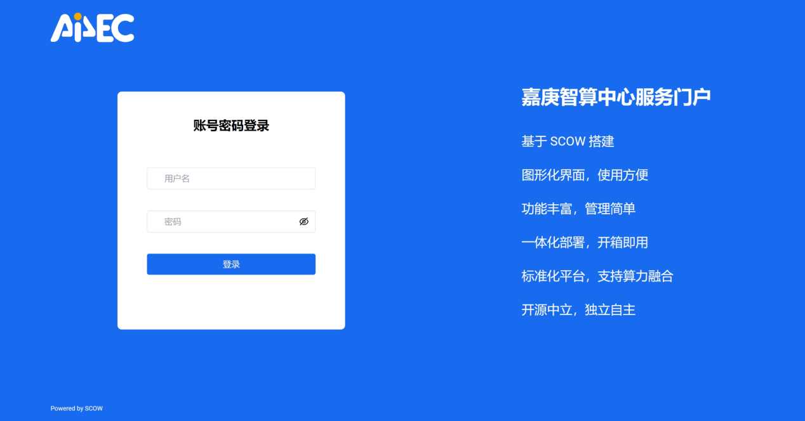
	- 校内用户：请在校园网范围内或使用 SSLVPN 访问访问： [http://10.26.14.63:8080/](http://10.26.14.63:8080/)
	- 校外用户：请使用零信任客户端访问，**SCOW 管理平台** 入口 对应嘉庚智算中心服务门户。**注意：嘉庚智算作业管理系统 WEB 为旧系统入口。**
		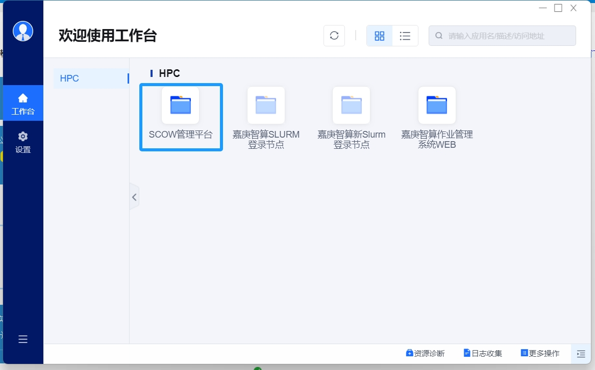

!!! tip "提示"
	现有用户登录服务门户的用户名、密码与登录到旧作业管理平台（<https://10.26.14.57>）对应的用户名和密码相一致。如用户密码遗忘，请查询注册时提供的电子邮箱或联系管理员进行重置。


## 如何提交作业

通过服务门户，便可以交互式地提交自己所需执行的任务。

首先请登录到服务门户，然后点击首页的提交作业：

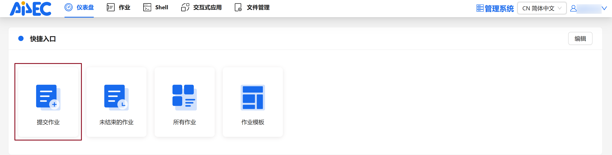

随后便可以根据需要填写对应的作业脚本、分区、qos、节点数、单节点核心数、最长运行时间，确认无误后可点击下面提交按钮。

以一个 CP2K 任务为例来展示用户可以如何通过前端实现作业的交互式提交。用户可以在“命令”栏中填入所想要提交的作业，下方工作目录填写目标任务相对于 `home` 目录的相对路径，并设定使用的节点数和核数（例如 64 核）及其他相关参数，即可点击提交。

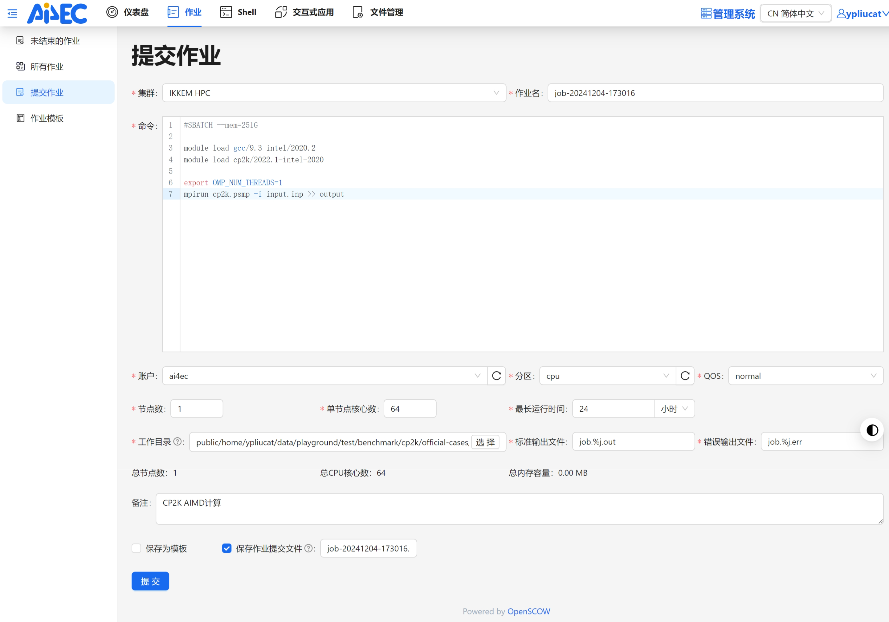

!!! warning "注意"
	- 暂时仅支持使用相对路径作为工作目录，无法正确解析绝对路径。
	- 通过网页端提交作业时，内存无法自定义调整，`cpu` 队列默认为每个核申请 1GB。

如未产生报错等信息，提交后会跳转到“本用户未结束的作业”模块，则用户可以检查任务的提交情况。

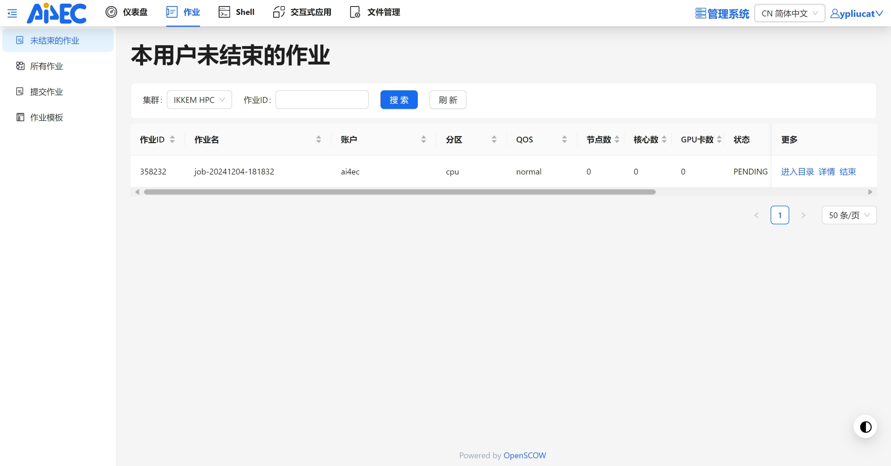

点击作业中的进入目录，可以看到作业标准/错误输出文件，支持下载、重命名、删除、提交


## 如何提交交互式应用——以 JupyterLab 为例

用户可以通过嘉庚智算提供的 Anaconda 在自己的用户下创建 Conda 环境并安装 PyTorch 等应用，然后通过嘉庚智算中心服务门户的“交互式作业”功能向 GPU 节点提交单机单卡作业，并通过 JupyterLab 交互式地训练模型。
### 环境准备

工欲善其事，必先利其器。

要想完成模型的训练，我们需要先搭建所需要的环境。

因此用户可以登录到嘉庚智算中心服务门户，并点击页面顶部的 Shell，进入到终端交互页面。

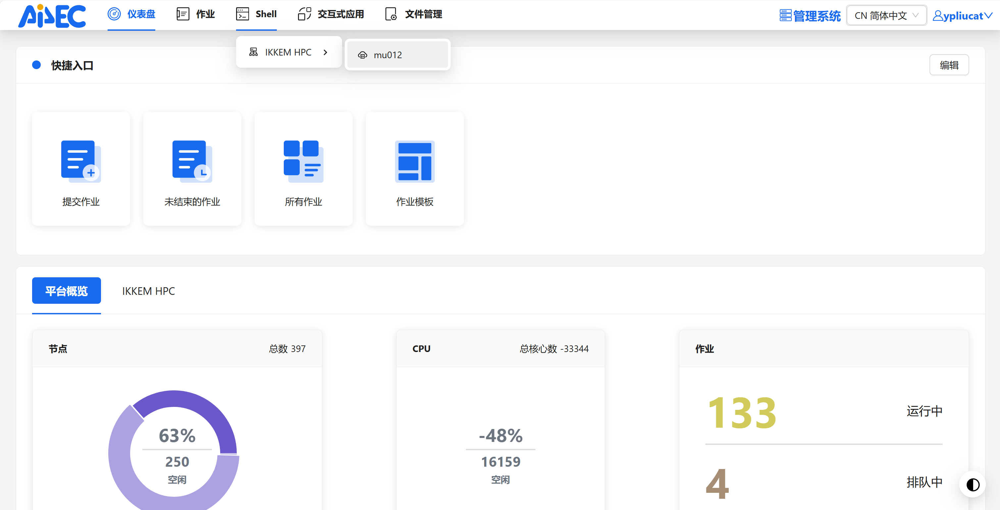

则可以打开一个终端页面，用户可以在此运行 Linux 命令。

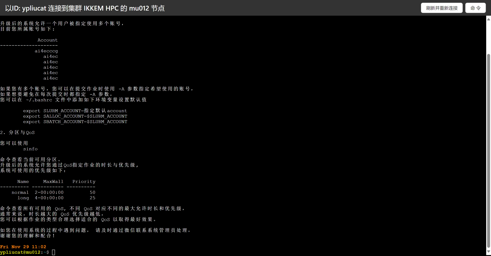

当然你也可以通过 Windows Terminal（Windows用户）、iTerm2（Mac用户）、MobaXTerm、Termius等等，由 SSH 登录到命令行终端，并执行命令。

然后你便可以在此开始部署环境，请依次输入如下的命令：

```
module load anaconda/2022.5
source activate base

```

如此便激活了集群提供的 Conda 环境，则用户可以创建自己的环境（此处取名为 `pytorch` ，通过 `-n` 选项指定），并安装 PyTorch。

```
conda create -n pytorch pytorch torchvision torchaudio pytorch-cuda=11.8 -c pytorch -c nvidia

```

运行后会出现是否安装的提示，这里输入 `y` 并回车即可确认：

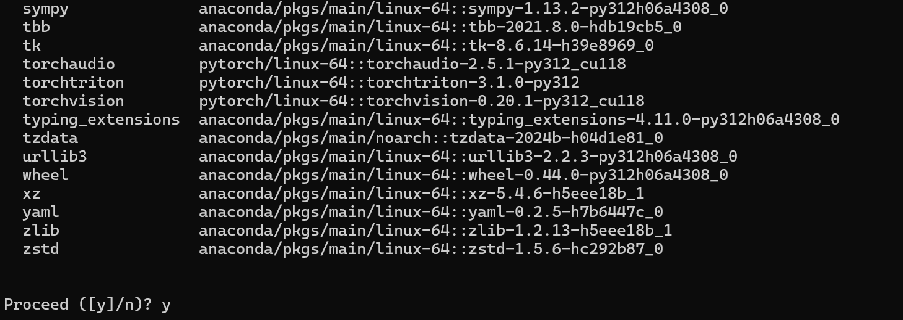

由此，我们便搭建了一个包含有 Python 3.12、CUDA 11.8、PyTorch 2.5.1 等软件的 Conda 环境。

随后，激活该环境，并安装 `jupyter` ，以使得我们后续可以利用这一环境提交 JupyterLab 作业。

```
source activate pytorch
pip install jupyter

```

其他需要安装的依赖，也请通过这一方式在登录节点的 `pytorch` 环境下安装：

```
pip install matplotlib pandas fastai

```

**注意：计算节点无法连接到外网。**

由此，我们便为后续的操作准备了相关的环境。

### 创建交互式应用

在准备了环境的基础上，用户即可按照如下方式来提交自己的作业。

在嘉庚智算中心服务门户页面上，选择 **“交互式应用”-“IKKEM HPC”-“创建应用”**

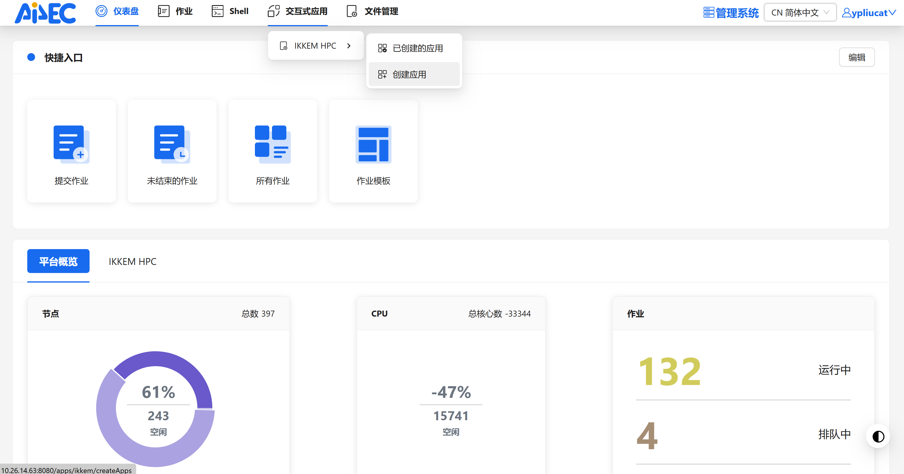

即可进入应用选择界面，目前 JupyterLab 应用已经上线：

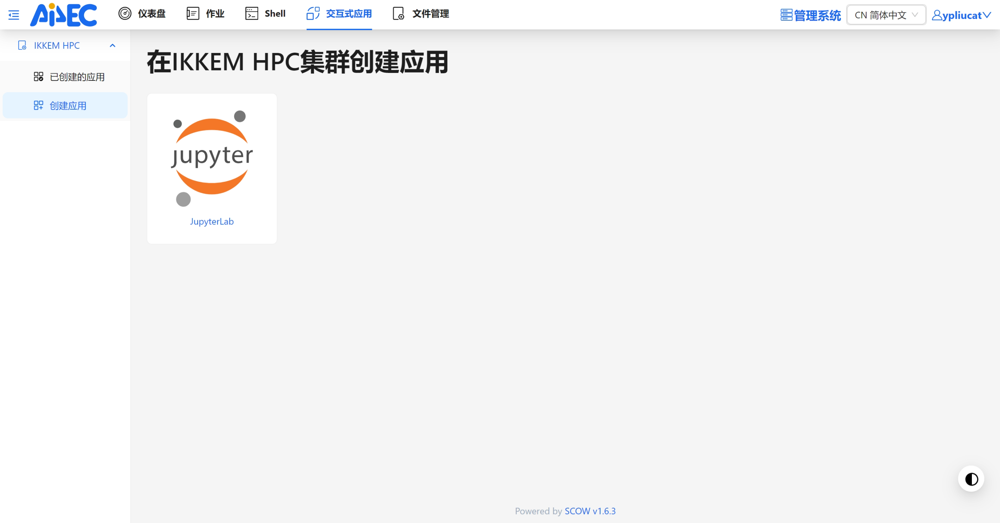

点击即可创建应用作业，相关参数的说明如图。按照我们上面所进行的实践，便可以按照图示的方式来对相关设置进行修改：

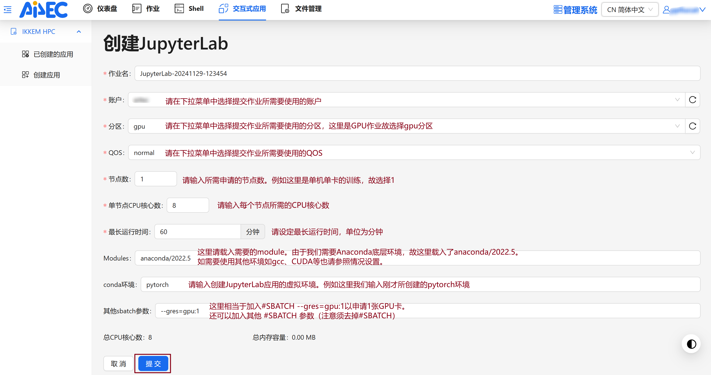

点击提交按钮，则可以提交一个 GPU 作业。稍等即可在 **“已创建的应用”** 页面点击 **“连接”** 以连接到在 GPU 节点上创建的 JupyterLab 服务。

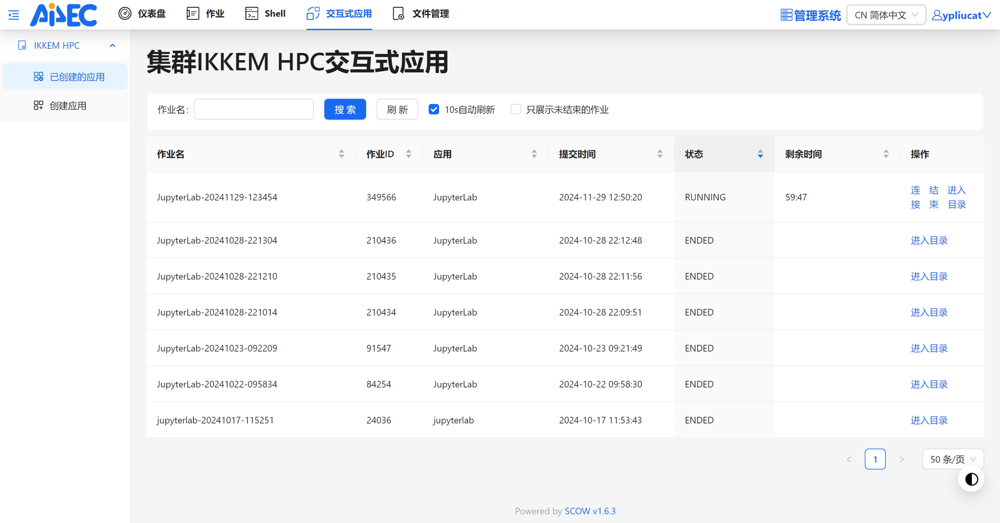

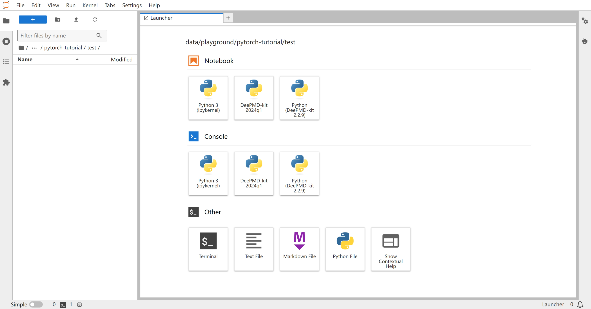

## 用户如何查看余额和作业提交情况

!!! info "提示"
	目前服务门户（<http://10.26.14.63:8080>）支持查询 2024/10/17 及以后各个用户所在账户的余额及历史作业。
	同时，旧 CE 平台（<https://10.26.14.57>）仅可用于查询 2024/10/17 以前的历史作业情况。

### 查看余额

如需查看自己拥有使用权限的账户余额，请在登录到服务门户后点击右上角的"管理系统"，可以跳转到管理界面。


此时，“仪表盘”界面即显示了当前拥有使用权限全部账户的可用额度，及当前尚未结束的作业列表：

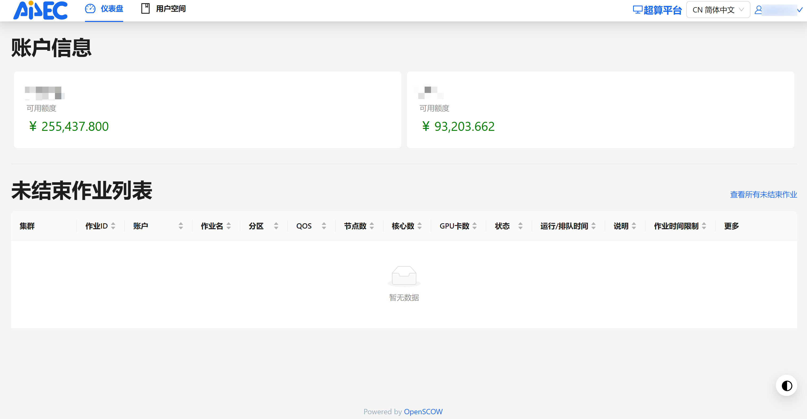

### 查看历史作业

同时，在“用户空间”界面中，用户还可以对自己尚未结束的作业及已经完成的作业进行详细查询，以确保自己的作业被正确扣费。

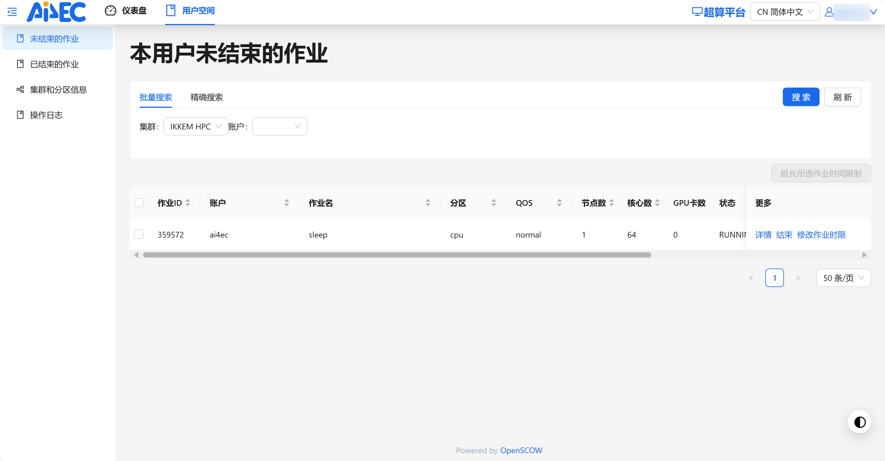

默认展示的即是“未结束的作业”，在此用户可以对当前正在运行的作业进行查询，检查其对应参数等。并可以按照自身所申请的账户进行批量搜索，也可以按照作业 ID 精确搜索。

而对于已结束的作业，用户也可以查询一段时间内的全部作业及其总计花费。

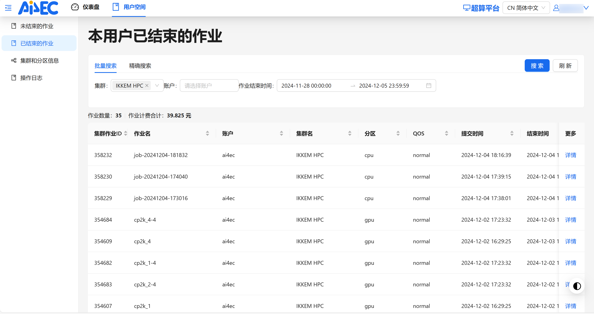

并且，可以对这些作业消耗的资源及机时情况进行详细核查。例如对 354607 作业，点击右侧的详情，可以看到如下图所示的信息：

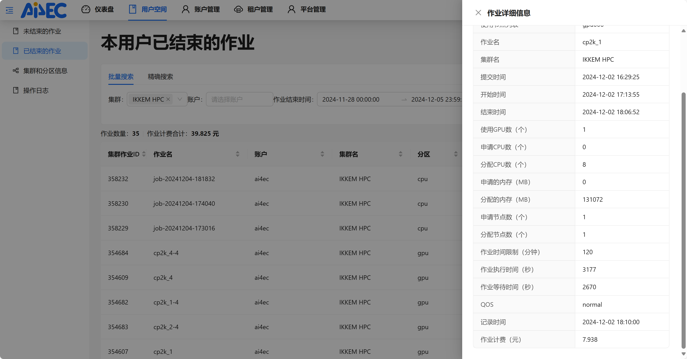

从图中可以看出，该 CP2K 作业申请了 1 张 GPU 卡、8 个 CPU 核，分配了 128 GB 内存，于 2024 年 12 月 2 日下午 16 时 29 分提交，排队 2670 s，作业实际运行 3177 s，消耗机时约 7.94 元。

而对于每个作业所申请资源所对应的单价情况及详细计费规则，请参见[分区规则和收费标准](../introduction/partition.md)。

## 账户管理员如何检查当前账户情况

!!! info "注意"
    本部分仅账户管理员可见。用户如需要了解账户的相关信息，请联系组内账户的所有者或管理员。

若您是账户的所有者或管理员，通过嘉庚智算服务门户，您可以方便地查看账户内用户的作业和消费情况。

### 用户管理

账户管理员可以根据项目实际对用户的各方面情况进行详细管理。关于如何利用服务门户进行项目管理，请参阅[嘉庚智算账户管理最佳实践](../blog/posts/20241205-project-management/index.md)。

### 经费管理

除此而外，账户管理员还可以在账户管理界面查看账户经费的到账和使用情况。

#### 充值记录

若要查看充值记录，请点击左侧的“充值记录”，如下图即显示出一段时间内的详细充值记录（默认为一年内，管理员可以自行设置所需时间尺度），并可以进行检索和导出。
支持按时间/类型搜索，可导出一段时间内的详细充值记录

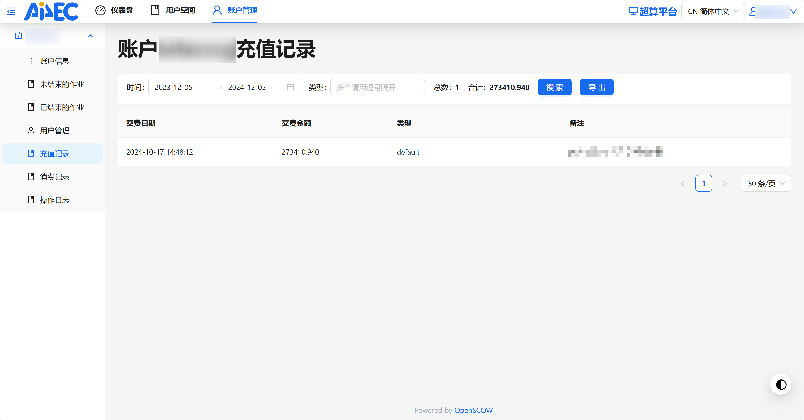

#### 消费记录

若要查看账户下各个用户的详细消费记录，则请点击左侧的“消费记录”。如图，则展示出一段时间内所有用户的作业扣费情况（默认为近 7 天，管理员可以自行设置所需的时间尺度），并可导出这段时间内的详细扣费记录，以便进行核查和对账。

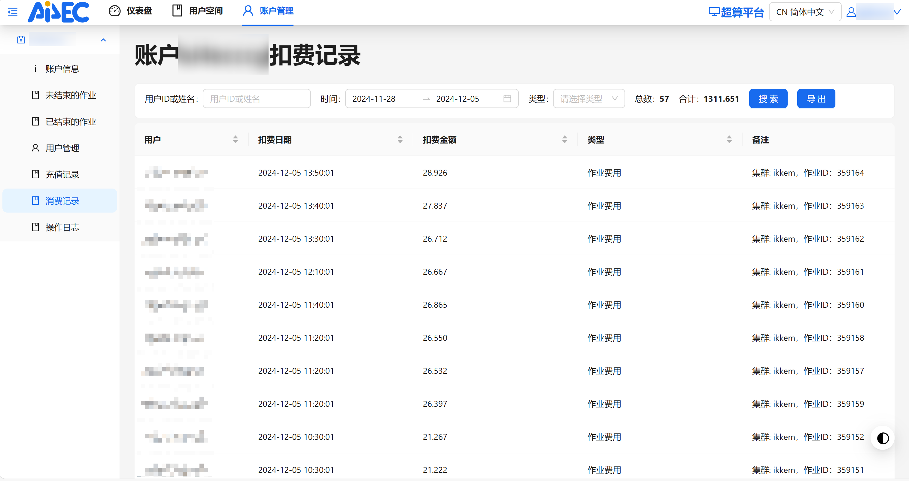