# SCOW 算力平台

## 平台概述

SCOW是一个算力平台系统，旨在解决算力中心在建设和运营中的运营管理难、用户使用难、资源融合难等痛点。它能够纳管各类异构算力资源，提供算力资源管理和使用功能，为算力中心提供更开放、更便捷、更灵活、更高效的运营平台解决方案。

## 用户操作指南

### 注册和登录

- 注册：用户需要通过邮箱发送申请表，申请表需用户ID、用户名（、用户邮箱、登录密码（统一设定，后续用户自行修改）；用户可主动联系平台管理员注销账号。管理账号欠费后，账号被封锁，管理账号及其所属上机账号可以继续登录系统，但不可以提交作业，3个月后不可以登录系统，6个月后数据将被删除，管理账号及所属上机账号将被全部注销。

- 登录地址：[http://10.26.14.63:8080/](http://10.26.14.63:8080/)，用户名和密码与集群LDAP以及之前的 CE 一致，如无法登录可联系系统管理员。
    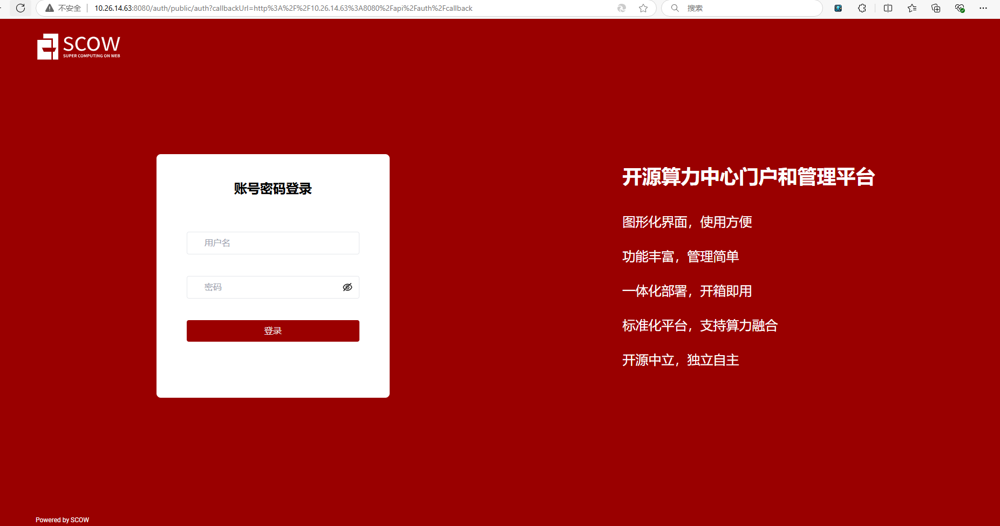

- 密码修改：请联系管理员进行修改

### 主界面介绍

- 仪表盘：分为两个部分，快捷入口和平台概览
- 快捷入口点击后面的+号可以自定义需要导入的模块

    

- 网页端可提交作业至集群
  - 进入scow平台后，点击提交作业

    

  - 需填写命令、分区、qos、节点数、单节点核心数、最长运行时间，确认无误后可点击下面提交按钮（也可以提交时选择保存为模板，方便同类型作业提交）

    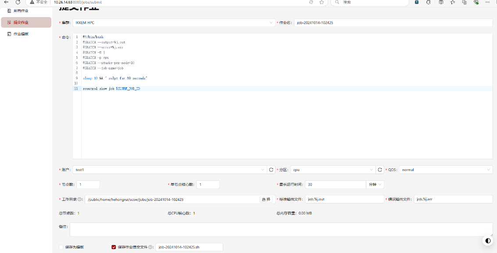

- 如没有报错，提交后会跳转到未结束的作业模块（可以同时选上作业模板，方便同类型作业提交），提交成功和作业ID

    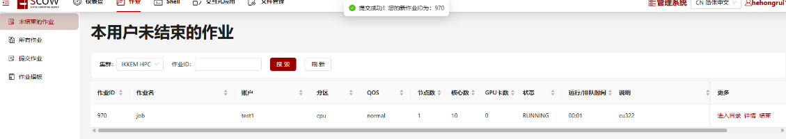

- 点击作业中的进入目录，可以看到作业标准/错误输出文件，支持下载、重命名、删除、提交

    

- 集群命令行界面登录：从shell模块中可进入到命令行界面

    

    

- 作业模板：可保存之前提交过的作业脚本

    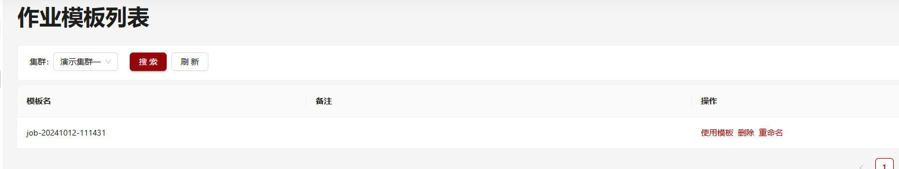

- 支持查看本用户所有历史作业，可按批量搜索（按集群）、精确搜索（按集群+作业ID）
    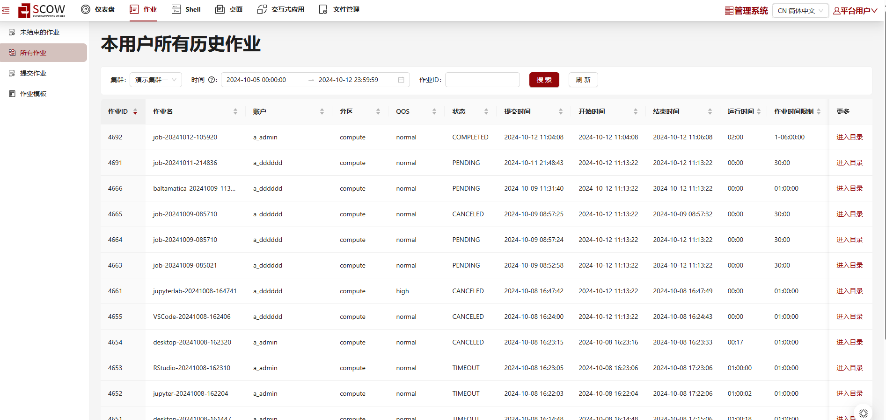

- 平台概览：包括集群CPU、GPU空闲可用节点，作业排队情况等
    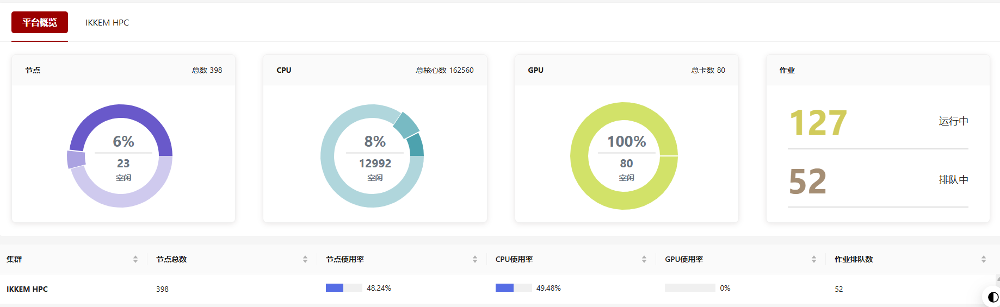

- 交互式应用模块
  - 用户可以在此使用平台提供的交互式应用，并提交到集群作业管理系统上，如 Jupyter、 VS Code 等。

    

- 文件管理模块：在网页端可以对自己目录下的文件进行增删改

    

### 账户信息

- 点击右上角的"管理系统"，可以跳转到"超算平台"页面

    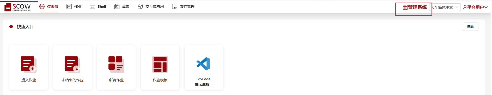

- 仪表盘：账户可用额度，未结束作业列表

    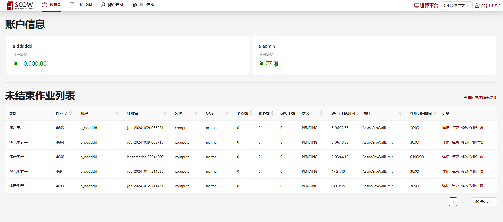

#### 用户空间模块

- 本用户未结束的作业：按批量搜索（按集群）、精确搜索（按集群+作业ID）

    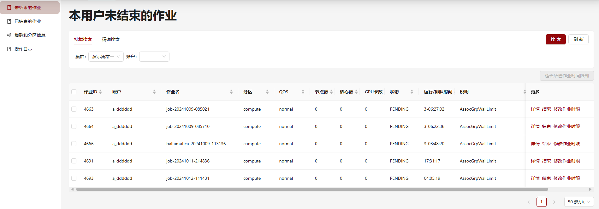

- 已结束的作业：按批量搜索（按集群）、精确搜索（按集群+作业ID）

    

- 集群和分区信息：含分区名、分区节点、单节点核心数、单节点GPU数、单节点内存、QOS、单价、计量方式

    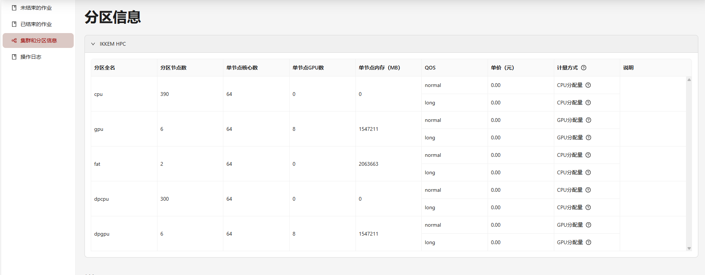

- 操作日志：支持按行为/结果/时间进行搜索，其日志内容主要记录的是在超算平台界面的操作，如shell登录、作业提交等

    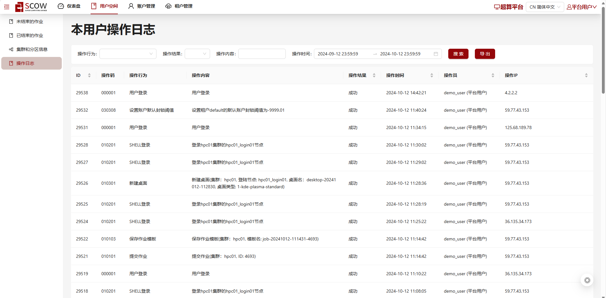

#### 账户管理模块

!!! info "注意"
    本部分仅账户管理员可见。用户如需要了解账户的相关信息，请联系组内账户的所有者或管理员。

- 账户信息：包含了账户信息、用户管理、充值记录、消费记录、操作日志模块

    

- 未结束的作业：按批量搜索（按集群）、精确搜索（按集群+作业ID）

    

- 已结束的作业：按批量搜索（按集群）、精确搜索（按集群+作业ID）

    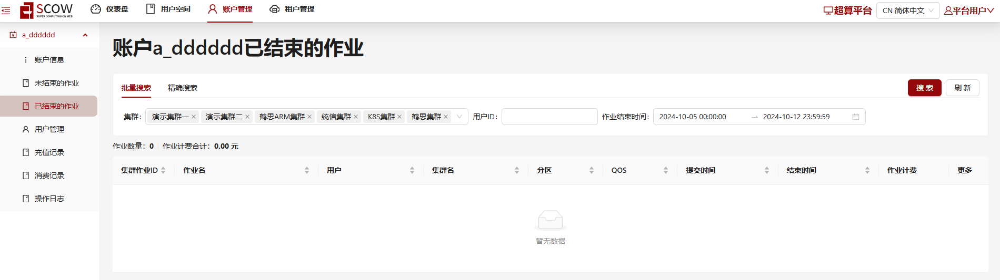

- 充值记录：支持按时间/类型搜索，可导出

    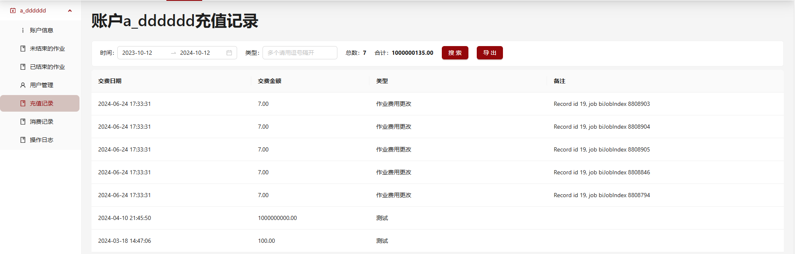

- 消费记录：支持按用户ID或用户名/时间/类型搜索，可导出

    
